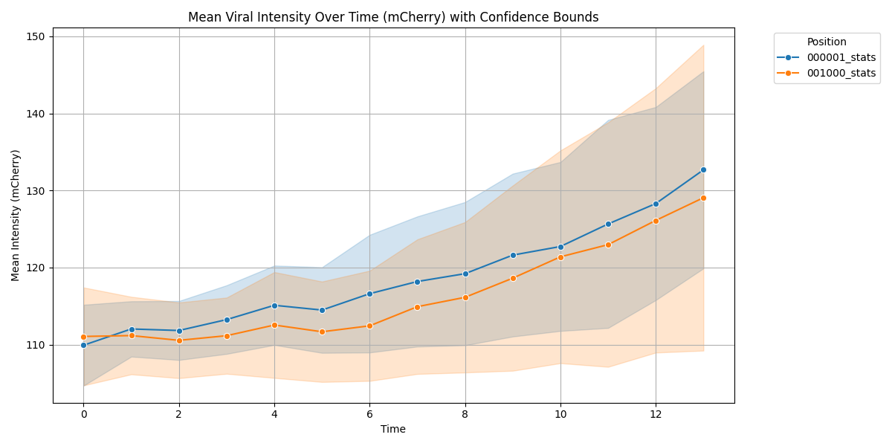

# Chan Zuckerberg Biohub Coding Assessment
This repo will contain all of the code related to the problems associated with the PDF given.

## Installation

### 1. Clone Repo
```bash
git clone https://github.com/N8Grant/ChanZuckerbergInterview.git
cd ChanZuckerbergInterview
```

### 2. Install Package
```bash
pip install .
```
Now your ready to use the tool so long as your python scripts folder is on your PATH variable.

### 3. Install Package For Devs
To install in developer mode make sure to include both the pip flag as well as the dev tag for the installation of all of the
required precommit libraries as well.

```bash
pip install -e .[dev]
pre-commit install
```

### 4. Run Tests
```bash
pytest
```

Now you can work on the package in dev mode as well as have pre-commits all hooked up for when you want to push changes.


## Examples

### Viewing A Dataset
To view a dataset using napari you can use the command

```bash
chanzuck view --dataset-path "<path_to_zarr>"
```
A napari window should pop up witha all of the wells and posisions displayed for you to look through.

*Note:* This command by default will try to display any existing segmenation labels on top of the image.
If this is not desired however it can be toggled off with the --no-show-segmentations flag.

### Describing a Dataset
To easily check the metadata within a dataset you can use the describe command as follows:

```bash
chanzuck view --dataset-path "<path_to_zarr>"
```

This command also has the option to wtire metadat to a file instead of just printing out in the cli.
You can do this by using the --out-file flag with the desired path following it.
If you would like just a regular json format instead of the well formatted cli output then provide the --json flag.

Options:
  --dataset-path PATH  Path to the dataset.  [required]
  --out-file FILE      Optional path to write metadata.
  --json               Output in JSON format instead of pretty CLI format.
  --help               Show this message and exit.

### Segment a Dataset
Segmenting nuclei out of a dataset is easy with chanzuck. All you have to do is run the command below and it will walk you through
setting up your segmentation routine.

```bash
chanzuck segment --dataset-path "<path_to_zarr>"
```

This will run segmentation and labeling over the given channel and try to temporally connect the labels so the time information is more useful.

#### Additional Parameters
Once ran it will prompt you for the index of the nuclei stain, dont worry you dont have to remember that though, it will
pull the information from the dataset so you can easily select it. However if you do know it ahead of time then you can add
the --channel-index flag to the command with an integer indicating teh index of the desired segmentation channel.

There are also two models to chose from using the --model-type command:
1. "cellpose": Open source cell detection model that can be very slow if you dont include the --gpu flag so be sure to add that in the command as well.
2. "otsu": Quick thresholding if you have a clean staining over the object of interest

#### Results
Use the view command on your dataset to see the results!

Example:


### Analyze a Dataset
Great now you've made it this far, its time to get insights out of your data. Using the following command you can extract spatial and intensity information out of your cell labels:

```bash
chanzuck generate-stats --dataset-path "<path_to_zarr>" --stats-dir "<path_to_output_folder>" <--visualize / --no-visualize>
```

This command will go over the segmentations you created in the previous step and pull out these statistics for each cell at each timepoint.
- label
- area
- centroid
- mean_intensity
- max_intensity
- min_intensity
- extent

If you selected --visualize then after statistics calculation is complete, the results will be summarized in tables. This will have the same effect as
running ```chanzuck plot-stats``` over already calculated features.

### Plotting Results
If you didnt already take advantage of the visualize flag after generating stats then have no fear you can still plot your results using the following command:
```bash
chanzuck plot-stats --stats-dir "<path_to_output_folder>"
```

This will search thru the given folder and look for csvs that can be used for plotting purposes. A window should pop-up shortly after submitting the command
that has a plot within it. Yuo can save the plot using the save button in the upper right or continue onto the next one by closing out of the window.

Heres an example of a plot generated by this command:



## Running with Docker
### 1. Build Docker Image
From the project root:
```bash
docker build -t chanzuck .
```

### 2. Run Segmentation
```bash
docker run - it --rm \
  -v /absolute/path/to/data:/data \
  chanzuck \
  segment \
  --dataset-path /data/your_dataset.zarr \
```
Replace /absolute/path/to/data with the full path to your local folder that contains the dataset and where results should be saved.

### 3. wARNING: Viewing is Only Supported Outside of Docker
The view command launches an interactive Napari GUI, which requires a display. This does not work inside Docker unless you have special GUI forwarding set up (e.g. X11 or VNC).

To run the viewer please follow the steps above.

## Example Scripts
The code for task 1 and task 2 can be found in ./tasks/task1.py and ./tasks/task2.py


## Goals
Complete each of the tasks:

### Task 1
- Convert the OME-TIFF to OME-Zarr using iohub ✅
- Inspect the converted OME-Zarr and retrieve key metadata using iohub (i.e, array
shapes, scale, channel names, chunk sizes, etc). Tell us what method you used and
save them in a text file. ✅
- Write a CLI to parse and pretty print metadata information of an OME-Zarr store. ✅
- Implement a PyTorch DataLoader that uses iohub and the OME-Zarr (Dataset 2) to
read data. ✅
- Profile the time it takes to read the data and to run inference with a pre-trained model
(e.g., those provided with torchivision). ✅

### Task 2
- Leverages iohub to handle the OME-Zarr 5D dataset (T, C, Z, Y, X) ✅
- Performs some basic image analysis ✅
- Segment the cells’ nuclei from your channel of choice and store the
segmentations into an OME-Zarr store using iohub as Zarr Arrays. ✅
- Computes at least 5 metrics or algorithms to characterize and detect the infection
dynamics. (e.g. intensity, segmentation, etc). Can you find the infected cells? ✅
- Generates visualizations of image data and the image analysis results (i.e, matplotlib,
napari, etc).✅
- Save the visualizations (e.g as .png, .mp4,.jpg, etc). You will share this
output with us. ✅
- Write a script that showcases the use of your API.
- Write a README.md that describes this pipeline so we can reproduce it.✅
- Speed up your functions! Parallelize methods in your image processing library. Which
workloads can benefit from GPU compute? ✅
- Profile the performance of the parallelized implementation. How does it scale with
different hardware resources? ✅

### Task 3
- Implement a command line interface (CLI) on top of this to interact with your image
management and analysis API. ✅
- Create a spec-conformant Python package that can be installed with frontends like pip
and uv. Make sure that the dependencies resolve correctly with a fresh virtual
environment. ✅
- Implement your CLI so that it shows a progress bar for long processing steps. ✅
- Don't forget to add usage instructions in the README.md. ✅
- Create a Docker container that uses your CLI to process data.
- Build your image, test it, and share it with us.
- Don't forget to add instructions in the README.md if you do.
